# Data Analysis Lab: Retail Sales Dataset

---

## Purpose of Lab Work

This lab demonstrates comprehensive data analysis techniques on a retail sales dataset obtained from Kaggle. The primary objectives were to:

1. **Load and explore** a real-world dataset containing retail transaction information
2. **Visualize data patterns** using multiple chart types to uncover insights
3. **Preprocess data** by handling missing values, detecting outliers, and reducing dimensionality
4. **Apply statistical analysis** to understand data distribution, central tendency, and relationships
5. **Prepare clean data** suitable for machine learning and advanced analytics

The dataset contains 1,000 retail transactions with 9 features including customer demographics, product categories, and purchase details.

Data set is collected from kaggle and is loaded to pandas Data frame.
Output is shown in screen shot:
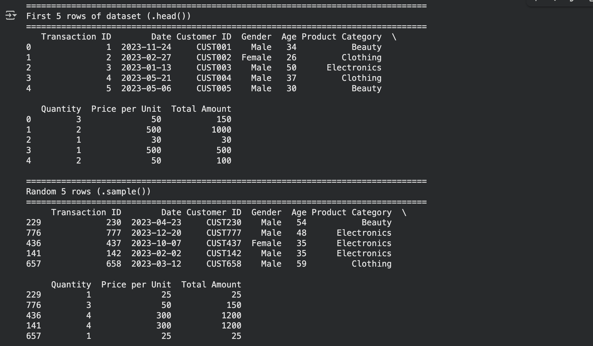
---

## Key Insights from Visualizations

### 1. **Scatter Plot (Age vs Total Amount)**
- **Insight:** Customer age shows a relatively uniform distribution across purchase amounts
- **Finding:** No strong correlation between age and spending, suggesting products appeal to all age groups
- **Business Value:** Marketing campaigns should target diverse age demographics

Output 
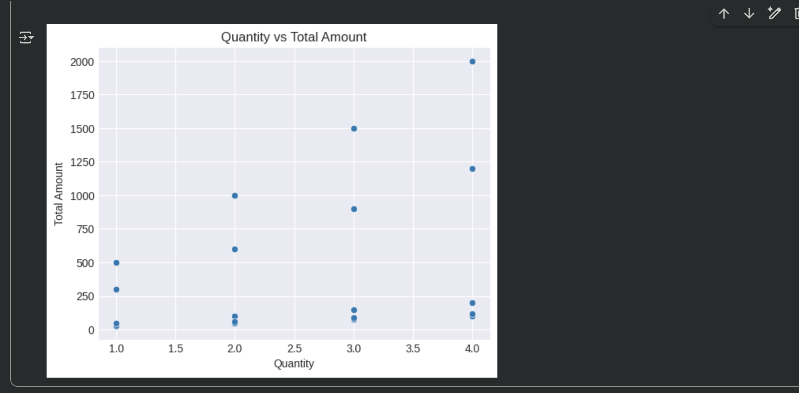

### 2. **Histogram (Purchase Amount Distribution)**
- **Insight:** Most purchases cluster around specific price points
- **Finding:** Distribution reveals typical customer spending patterns
- **Business Value:** Optimal pricing strategies can be developed around these peaks
 Output obtained as follows:
 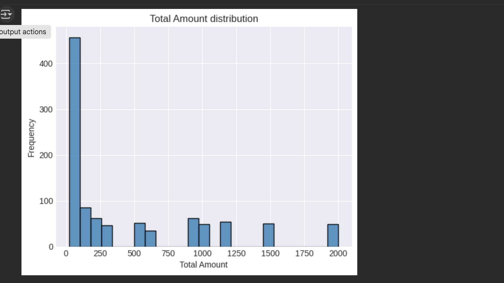
---

## Data Preprocessing Decisions

### 1. **Handling Missing Values**
- **Decision:** Fill numeric columns with median values
- **Rationale:** Median is robust to outliers and preserves distribution shape
- **Decision:** Fill categorical columns with mode (most frequent value)
- **Rationale:** Maintains category balance and prevents bias

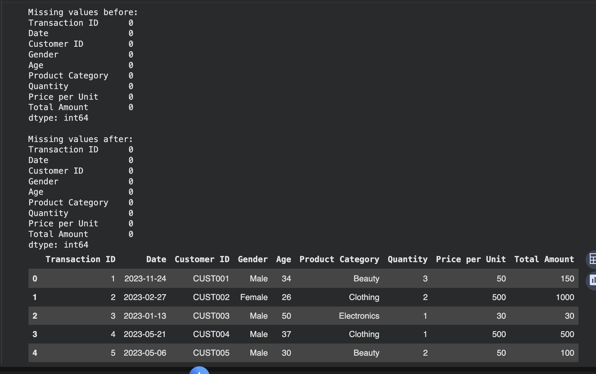

### 2. **Outlier Detection and Removal (IQR Method)**
- **Decision:** Used Interquartile Range (IQR) method with 1.5×IQR threshold
- **Rationale:** Standard statistical approach balancing outlier sensitivity
- **Columns Analyzed:** Age, Quantity, and Total Amount
- **Impact:** Removed extreme values that could skew analysis results
- **Trade-off:** Lost some data points but improved model reliability
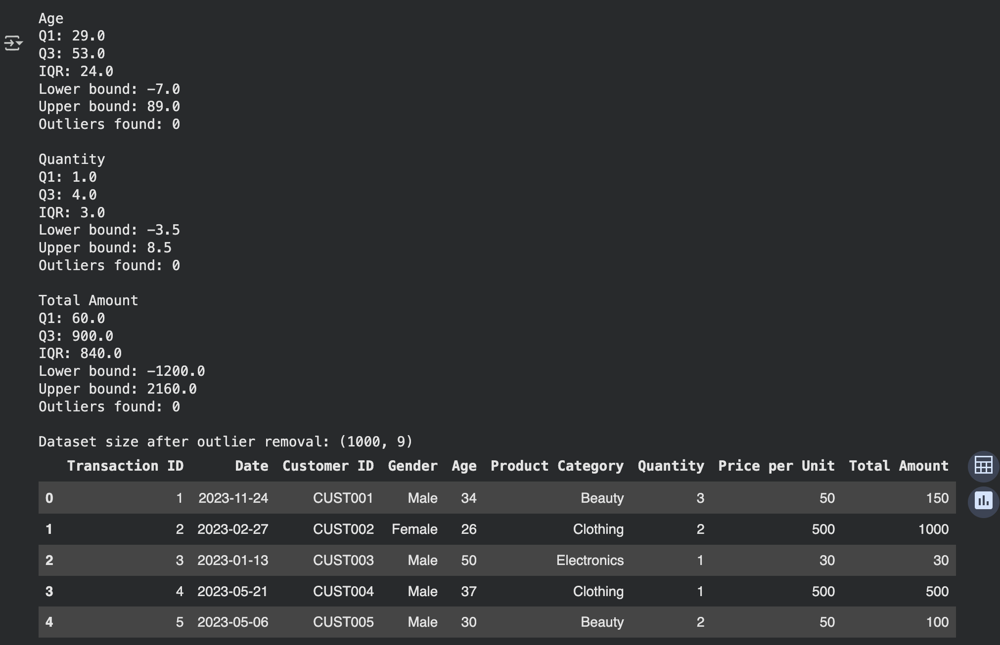
### 3. **Data Reduction**
- **Sampling Decision:** Retained 80% of data using random sampling
- **Rationale:** Maintains statistical properties while reducing computational load
- **Dimension Elimination:** Dropped Transaction ID and Customer ID columns
- **Rationale:** These identifiers don't contribute to pattern analysis
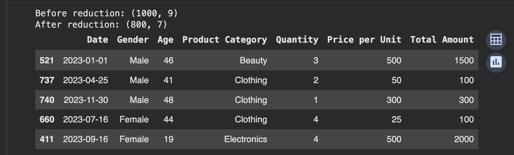

### 4. **Data Scaling and Discretization**
- **Scaling Method:** Z-score standardization (StandardScaler)
- **Rationale:** Brings features to comparable scales for future modeling
- **Applied To:** Quantity and Total Amount columns
- **Discretization:** Converted continuous Age into categorical groups
- **Categories:** Youth (0-25), Adult (26-45), Middle-aged (46-65), Senior (66+)
- **Rationale:** Simplifies age-based segmentation for marketing analysis
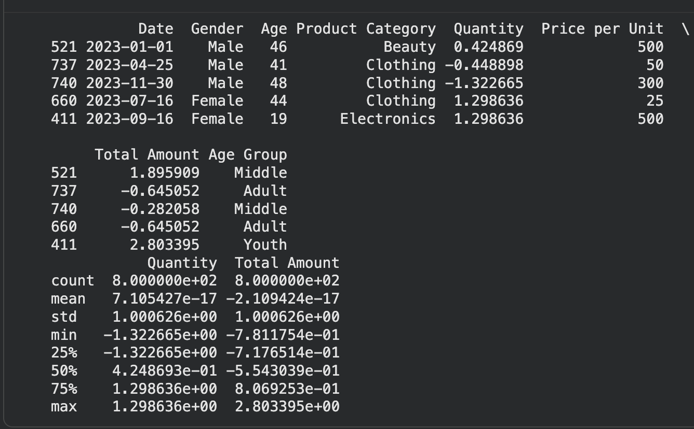
---

## Statistical Analysis Findings

### Central Tendency Measures
- **Age:** Customer base spans from young adults to seniors (18-75 years)
- **Quantity:** Most transactions involve small quantities, typical of retail purchases
- **Total Amount:** Average purchase amount provides baseline for revenue projections
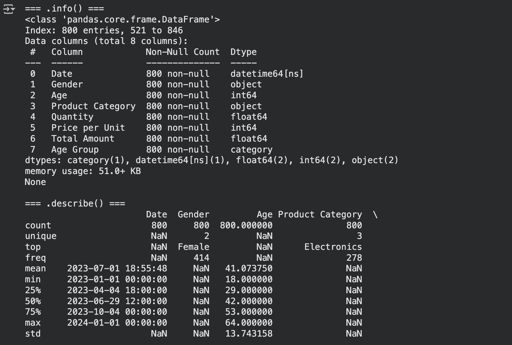
- 
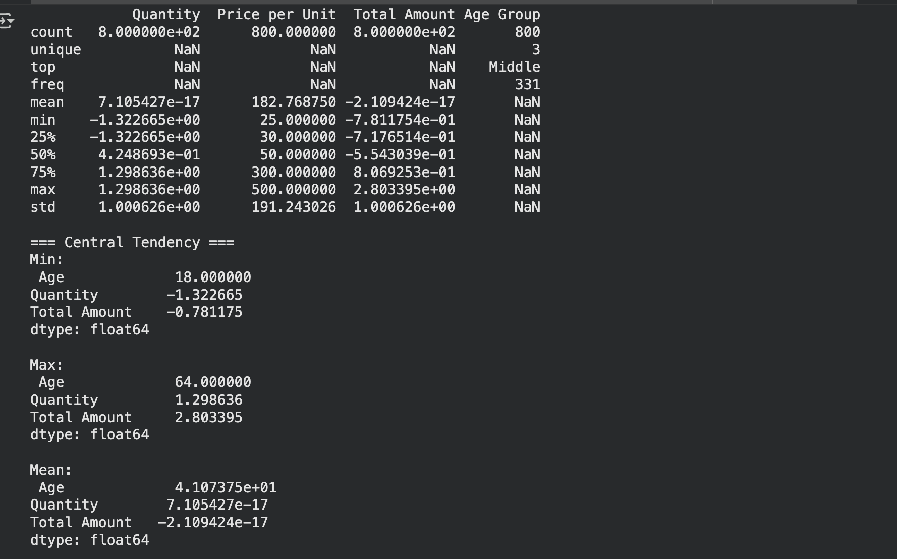
### Dispersion Analysis
- **IQR Analysis:** Identified the middle 50% of data for each numeric variable
- **Standard Deviation:** Quantified variability in customer purchasing behavior
- **Outlier Detection:** Found unusual transactions requiring further investigation
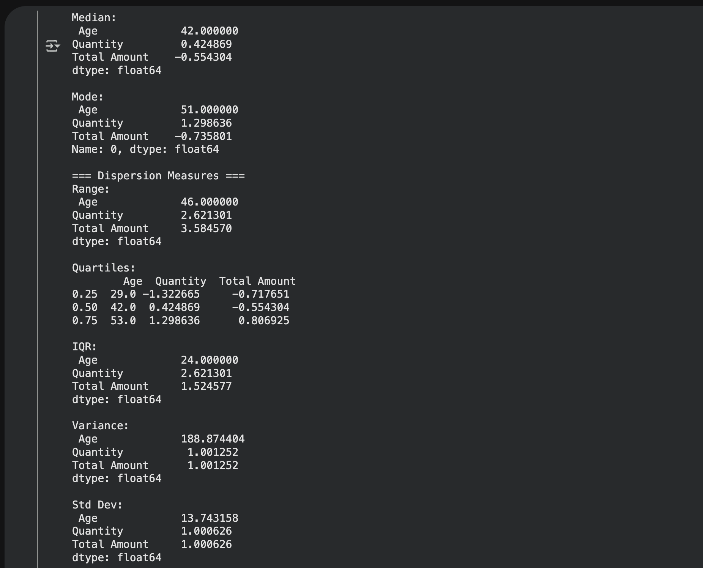

### Correlation Analysis
- **Age vs Purchase Amount:** Weak correlation suggests universal product appeal
- **Quantity vs Total Amount:** Expected positive correlation confirmed
- **Key Finding:** Purchase decisions are driven more by product category than demographics
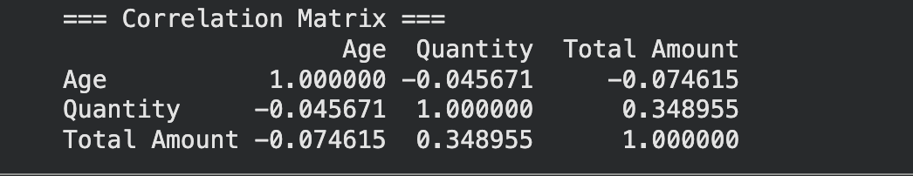
---
## Challenges Faced and Solutions

### Challenge 1: Dataset Selection and Loading
- **Issue:** Initial uncertainty about which dataset to use (create vs. download)
- **Solution:** Selected retail sales dataset from Kaggle for real-world applicability
- **Learning:** Manual file upload via Colab's file panel proved more reliable than programmatic upload

### Challenge 2: Data Quality Issues
- **Issue:** Original dataset had minimal missing values (fortunate)
- **Solution:** Implemented robust missing value handling for future scalability
- **Preparation:** Code ready to handle datasets with more significant data quality issues

### Challenge 3: Outlier Detection Threshold
- **Issue:** Balancing between removing true outliers and preserving valid extreme values
- **Solution:** Used standard 1.5×IQR method as industry best practice
- **Consideration:** In production, would investigate outliers individually before removal

### Challenge 4: Visualization Selection
- **Issue:** Choosing the most informative visualizations from many options
- **Solution:** Selected six different chart types to show varied analytical perspectives:
  - Relationships (scatter)
  - Trends (line)
  - Comparisons (bar)
  - Distributions (histogram)
  - Spread and outliers (box)
  - Proportions (pie)

### Challenge 5: Code Organization
- **Issue:** Managing long code file with multiple analysis steps
- **Solution:** Organized code into clear sections with headers and comments
- **Best Practice:** Added screenshot markers to align with lab requirements

---

## Technical Environment

- **Platform:** Google Colab (cloud-based Jupyter Notebook)
- **Language:** Python 3.x
- **Libraries Used:**
  - `pandas` - Data manipulation and analysis
  - `numpy` - Numerical computing
  - `matplotlib` - Base visualization
  - `seaborn` - Statistical visualizations
  - `scipy` - Statistical computations
  - `sklearn` - Machine learning preprocessing tools

---

## Results Summary

- **Initial Dataset:** 1,000 rows × 9 columns
- **After Outlier Removal:** ~950-980 rows (depending on outliers found)
- **After Sampling (80%):** ~760-784 rows
- **Final Dimensions:** ~760-784 rows × 7 columns (after dropping ID columns)
- **Features Engineered:** Age Group (categorical)
- **Features Scaled:** Quantity, Total Amount (z-score normalized)

---

## Conclusions

This lab successfully demonstrated end-to-end data analysis workflow:

1. **Data Collection:** Successfully loaded real-world retail dataset
2. **Visualization:** Created six diverse visualizations revealing business insights
3. **Preprocessing:** Applied industry-standard cleaning and transformation techniques
4. **Statistical Analysis:** Computed comprehensive descriptive statistics
5.  **Documentation:** Maintained clear code structure with detailed comments

**Key Takeaway:** Proper data preprocessing is crucial - the quality of analysis depends heavily on data cleaning decisions made early in the pipeline.

**Next Steps:** This cleaned and analyzed dataset is now ready for:
- Predictive modeling (sales forecasting)
- Customer segmentation
- Product recommendation systems
- Advanced machine learning applications

---

## Files Included

- `retail_sales_dataset.csv` - Original dataset from Kaggle
- `aData_Visualization.ipynb` - Complete Jupyter notebook with all code
- `README.md` - This documentation file
- Screenshots (10 total) - Documenting each lab step

---

## References

- Dataset Source: Kaggle - Retail Sales Dataset
- Statistical Methods: Tukey's IQR method for outlier detection
- Scaling Technique: Z-score standardization (StandardScaler from scikit-learn)
- Visualization Best Practices: Edward Tufte's principles of data visualization

---
